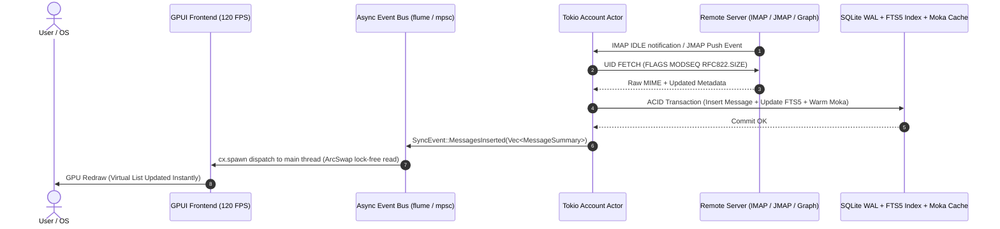

<div align="center">

# 🕊️ Vespetrel

### The 120 FPS Pure Rust Desktop Mail Client
**Thunderbird Feature Parity • Sub-15ms Search • Sub-50MB Memory • GPU-Native UI**

[](https://www.rust-lang.org)
[](https://crates.io/crates/gpui-kit)
[](LICENSE)
[](https://github.com/SV-stark/Vespetrel/releases/tag/nightly)
[-orange.svg?style=flat-square)](https://www.sqlite.org/fts5.html)
[](https://github.com/SV-stark/Vespetrel/actions)
[](https://github.com/SV-stark/Vespetrel/pulls)

[Features](#-features) • [Architecture](#-architecture) • [Comparison](#-head-to-head-vs-thunderbird) • [Provider Support](#-provider-compatibility-matrix) • [Workspace](#-workspace-structure) • [Getting Started](#-getting-started) • [Roadmap](#-roadmap)

</div>

---

## ⚡ Why Vespetrel?

Modern desktop email clients are almost universally trapped in web runtimes (Electron, Gecko, Chromium) that consume gigabytes of memory, introduce sluggish typing latency, and struggle when searching 50k+ local mailboxes.

**Vespetrel** is built from the ground up in **100% memory-safe Rust** utilizing **`gpui-kit 0.6.0`** (standard `Root` / `init` / `component::input` layers). It directly renders UI elements on the GPU via Metal, Vulkan, and Direct3D at silky **120+ FPS**, maintaining an idle footprint under **50MB** while matching Thunderbird's complete feature suite: **Email + Calendars (CalDAV) + Contacts (CardDAV) + OpenPGP/S-MIME encryption + Instant Global Search**.

```
┌────────────────────────────────────────────────────────────────────────────────────────────┐
│                                   VESPETREL ARCHITECTURE                                   │
│                                                                                            │
│  ┌──────────────────────────────────────────────────────────────────────────────────────┐  │
│  │ GPUI-KIT 0.6.0 FRONTEND (GPU Metal / Vulkan / DirectX @ 120 FPS)                  │  │
│  │ • 3-Pane Dock Layout (Folders, Virtual Thread List, Message Viewer)                  │  │
│  │ • Interactive Setup Wizard (Input/InputState, masked password + eye toggle)         │  │
│  │ • Tree-sitter Rich Markdown/Plaintext Editor (<2ms keypress latency)                 │  │
│  │ • Virtualized scrolling capable of fluidly displaying 200,000+ emails               │  │
│  └───────────────────────────────────────────┬──────────────────────────────────────────┘  │
│                                              │ Async Event Bus (flume bridge Tokio → GPUI)   │
│                                              ▼                                             │
│  ┌──────────────────────────────────────────────────────────────────────────────────────┐  │
│  │ TOKIO ASYNC SYNC CORE                                                                │  │
│  │ • Isolated Account Actors (IMAP IDLE, QRESYNC, CONDSTORE, JMAP RFC 8620/8621)        │  │
│  │ • Microsoft Graph REST Engine (Corporate Exchange Online Parity)                     │  │
│  │ • Persistent SQLite Outbox (retry backoff + scheduled send + graceful shutdown)      │  │
│  │ • OAuth2 PKCE Browser Flow (127.0.0.1:0 loopback, CSRF + Host validation)           │  │
│  │ • PIM Engine (libdav + icalendar + vcard4 CalDAV/CardDAV)                           │  │
│  │ • Security: rPGP (OpenPGP RFC 9580 v6) + RustCrypto S/MIME + OS Keyring              │  │
│  └───────────────────────────────────────────┬──────────────────────────────────────────┘  │
│                                              │ Transactional Storage (deadpool-sqlite)     │
│                                              ▼                                             │
│  ┌──────────────────────────────────────────────────────────────────────────────────────┐  │
│  │ LOCAL STORAGE & BM25 SEARCH                                                          │  │
│  │ • Rusqlite in WAL Mode + Memory-Mapped I/O (quick_check verified)                   │  │
│  │ • SQLite FTS5 (unicode61 remove_diacritics) for sub-15ms search across 200k mails    │  │
│  │ • Moka TinyLFU Cache + ArcSwap lock-free UI state for 120 FPS rendering             │  │
│  │ • Compressed Raw RFC822 Blob Store (lz4 / zstd) for offline resilience               │  │
│  └──────────────────────────────────────────────────────────────────────────────────────┘  │
└────────────────────────────────────────────────────────────────────────────────────────────┘
```

---

## 🚀 Head-to-Head vs. Thunderbird

| Feature / Metric | Mozilla Thunderbird | Electron Clients (Superhuman, Mailspring) | **Vespetrel** |
|---|---|---|---|
| **Cold Startup Time** | ~2.5s – 5.0s | ~3.0s – 6.0s | **< 200ms** |
| **Idle Memory (RAM)** | 500MB – 1.2GB | 600MB – 1.5GB | **~35MB – 65MB (`mimalloc`)** |
| **Rendering Framework** | Gecko (HTML/XUL/JS) | Chromium / DOM | **gpui-kit 0.6.0 (Direct GPU Shader Pipeline @ 120 FPS)** |
| **Typing Latency** | 20ms – 40ms | 15ms – 30ms | **< 2ms (Tree-sitter GPU quads)** |
| **Search (100k Emails)** | 2.5s – 8.0s (Gloda) | Cloud-dependent | **< 15ms (Local SQLite FTS5 BM25 + SIMD)** |
| **Large Mailbox List** | Micro-stutters on large folders | DOM virtualization jitter | **GPU-accelerated native list (Direct GPU shader pipeline)** |
| **Memory Safety** | C++ / JS | JS / Node.js | **100% Safe Rust 2024 Edition** |
| **Modern Protocols** | IMAP/POP only (No JMAP/Graph) | Proprietary cloud sync | **IMAP + JMAP + MS Graph REST + CalDAV + CardDAV** |
| **Tracker & Pixel Shield** | Add-on required | Cloud proxy | **Built-in `lol_html` streaming pixel stripper** |
| **End-to-End Encryption** | OpenPGP + S/MIME | Add-on or cloud | **Native `rPGP` (RFC 9580 v6) + Autocrypt 1.1 + S/MIME** |
| **Global Memory Allocator** | System malloc (fragmentation) | V8 Heap Manager | **`mimalloc` (-40% RAM fragmentation)** |

---

## 🔄 Real-Time Synchronization Pipeline



---

## 🌐 Provider Compatibility Matrix

Vespetrel natively abstracts differences between modern and legacy email protocols through its unified `MailProvider` trait:

| Provider | Auth Method | Email Protocol | Push / Sync Method | Calendar | Contacts |
|---|---|---|---|---|---|
| **Gmail / Google Workspace** | OAuth2 + PKCE | IMAP (`X-GM-EXT-1`) | IMAP IDLE | CalDAV | CardDAV |
| **Microsoft 365 (Enterprise)** | Entra ID OAuth2 | Microsoft Graph REST | Delta Tokens (`/messages/delta`) | Graph Events | Graph Contacts |
| **Outlook.com (Personal)** | OAuth2 + PKCE | IMAP / SMTP | IMAP IDLE | Graph Events | Graph Contacts |
| **Fastmail** | App Password / Bearer | JMAP (RFC 8620/8621) | EventSource (SSE) / WebSocket | CalDAV / JMAP | CardDAV / JMAP |
| **Apple iCloud** | App Password | IMAP / SMTP | IMAP IDLE | CalDAV | CardDAV |
| **Nextcloud** | Password / App Token | IMAP / SMTP | IMAP IDLE | CalDAV | CardDAV |
| **Self-Hosted (Dovecot / Stalwart)** | Plain / SCRAM / XOAUTH2 | IMAP4rev2 / JMAP | IMAP IDLE / Push | CalDAV | CardDAV |

---

### 🧙 Interactive Setup Wizard & Dual Gmail Auth
* **New Mail Setup Wizard**: Real `gpui-kit` `Input`/`InputState` fields for Email Address, Display Name, Password / App Password, Incoming Server & Port, and Outgoing Server & Port, with masked password + show/hide eye toggle and quick preset chips (Personal / Work / Team).
* **OAuth2 Browser Redirect (PKCE)**: Ephemeral loopback listener on `127.0.0.1:0`, SHA-256 code challenge + CSRF state, strict Host-header check (DNS-rebinding guard), system-browser consent (`accounts.google.com` / `login.microsoftonline.com`), friendly HTML confirmation page, and automatic OpenID userinfo discovery to fill email/display name.
* **Dual Gmail Modes**: `🌐 Browser OAuth2` one-click web auth with token exchange + OS keyring storage, or `🔑 App Password (IMAP)` direct `imap.gmail.com:993` / `smtp.gmail.com:587` with contextual hint to `myaccount.google.com/apppasswords`.
* **Persistent Outbox & Token Refresh**: Disk-backed SQLite outbox with retry backoff, scheduled-send support, background worker with graceful shutdown + `flume` wake triggers; proactive OAuth2 refresh 60s before expiry with cached-credential fallback.

### 🎨 7-Pillar Customization & Betterbird Parity
* **Diacritic-Insensitive Quick Filter**: Sub-millisecond search across active folder lists with automatic accent folding (`é, à, ö, ü, ñ, ç, ß` → ASCII) and full `/regex/` pattern evaluation.
* **Multi-Template HTML Signatures**: Visual designer generating email-safe responsive HTML signatures across 4 templates (*Modern*, *Minimal*, *Corporate*, *Creative*) with avatars, social badges, and per-account assignment.
* **Per-Account & Folder Accent Colors**: Customizable color indicators persisted in SQLite for instant visual recognition across complex multi-account setups.
* **Multi-Density Message Rows**: User-selectable row density modes (`Compact` 32px, `Comfortable` 64px, `Roomy` 96px) matching user workspace preferences.
* **7-Pillar Settings Engine**: Comprehensive GUI preferences modal controlling Layout, Themes (Dark/Light/OLED Black), Typography, Triaging, Composer, Keyboard Shortcuts, and Privacy/Security.

### 📬 Complete Mail Engine
* **Protocol Diversity**: Full support for standard **IMAP4rev2** (`IDLE`, `CONDSTORE`, `QRESYNC`, `SPECIAL-USE` with `VANISHED (EARLIER)` / `EXPUNGE` propagation and incremental UID sync), modern **JMAP** (RFC 8620/8621), and **Microsoft Graph REST** (for corporate Microsoft 365 environments where IMAP is disabled).
* **MIME Parsing**: Powered by `mail-parser` for zero-copy string slicing (`Cow<str>`), streaming attachments, and robust decoding of 41 legacy character sets.
* **OAuth2 with PKCE**: Built-in graphical authorization with ephemeral loopback callbacks (`127.0.0.1:0`), SHA-256 challenge + CSRF/Host validation, automated token rotation (60s proactive refresh), and credential storage in the OS credential manager (`keyring-rs` v4, non-blocking `spawn_blocking` load).
* **SMTP & Delivery**: High-throughput transmission via `lettre` with `send_live` + XOAUTH2, automated DKIM signing (`aws-lc-rs`, RFC 6376 relaxed/relaxed) and Autocrypt 1.1 header injection. Outbound mail queues in the persistent SQLite outbox.

### 🛡️ Security & Privacy First
* **Tracker Shield**: Real-time streaming HTML rewriter (`lol_html`) strips remote tracking pixels (1x1 transparent GIFs), tracking URL queries, and un-sanitized script/form tags.
* **Remote Content Blocker**: Remote images, styles, `srcset`, and `poster` attributes are blocked by default until explicitly trusted per sender. Strict CSP + CID rewrite in the sandboxed viewport.
* **End-to-End Encryption**: Pure Rust **`rPGP`** implementation supporting OpenPGP RFC 9580 (v6 keys & AEAD, PGP/MIME verified, no mock fallback) and Autocrypt 1.1 key exchange, alongside `RustCrypto` S/MIME X.509 DER validation (strict PKCS/CMS OID + ASN.1, `smime-verify` gated decrypt).
* **Hardening**: Deterministic FNV-1a `stable_uid_from_id` (no restart collisions), symlink-traversal guard + corrupt-account quarantine + transactional signatures, 16MB IMAP response cap with zero-alloc fetch parsing, `webpki-roots` TLS, `cargo-deny` supply-chain audit (`openssl-sys` banned, unknown registries denied).

### 📅 Integrated PIM (Calendar, Contacts & Tasks)
* **CalDAV**: Direct two-way sync with Google Calendar, Nextcloud, Fastmail, and Apple iCloud via `libdav` and `icalendar` (RFC 5545).
* **CardDAV**: Address book synchronization with auto-complete chips in the compose editor (`vcard4` RFC 6350).
* **Tasks Engine**: Full RFC 5545 `VTODO` task tracking with due dates, priority, status filters, and CalDAV synchronization.

---

## 📦 Workspace Structure

Vespetrel is architected as a highly modular Cargo workspace:

```
vespetrel/
├── Cargo.toml                  # Workspace manifest & shared dependencies (gpui-kit 0.6.0, aws-lc-rs)
├── rust-toolchain.toml         # Pinned stable Rust toolchain
├── packaging/                  # Native packaging: windows/ (.nsi + manifest), linux/ (.desktop), macos/ (Info.plist)
├── .github/workflows/          # CI matrix (fmt + clippy + test + release build + headless verify + cargo-deny audit) & nightly release
├── crates/
│   ├── vespetrel-app/          # gpui-kit entrypoint, dock layout, virtual lists, login wizard modal, settings & UI
│   ├── vespetrel-core/         # Domain models (Account, Message, Settings, HTML Signatures, Thread, Contact) + stable_uid
│   ├── vespetrel-storage/      # Rusqlite WAL storage, FTS5 BM25 search, Moka cache, LZ4/Zstd blob store, outbox tables
│   ├── vespetrel-engine/       # Tokio sync coordinator, account worker actors, persistent outbox & Flume event bridge
│   ├── vespetrel-imap/         # IMAP client actor with IDLE, CONDSTORE, QRESYNC & XOAUTH2
│   ├── vespetrel-jmap/         # JMAP client adapter (RFC 8620/8621)
│   ├── vespetrel-graph/        # Microsoft Graph REST client for Exchange Online
│   ├── vespetrel-smtp/         # Lettre submission engine with DKIM & Autocrypt
│   ├── vespetrel-dav/          # CalDAV / CardDAV sync engine via libdav, icalendar & vcard4
│   ├── vespetrel-crypto/       # rPGP OpenPGP (RFC 9580), S/MIME, Autocrypt 1.1 & OS keyring
│   └── vespetrel-render/       # SIMD UTF-8 HTML sanitization (ammonia, lol_html), auth badges, MDN, cleaner & anti-phishing
```


---

## 🛠️ Getting Started

### Prerequisites
* **Rust**: Pinned stable toolchain (1.85+ / 2024 edition) via `rustup` (+ `rustfmt`, `clippy` components for CI).
* **C Compiler / Build Tools**:
  * **macOS**: Xcode Command Line Tools (`xcode-select --install`)
  * **Linux**: `libkeyutils-dev libdbus-1-dev pkg-config libssl-dev libfontconfig1-dev libxkbcommon-dev libxkbcommon-x11-dev libxcb1-dev libxcb-shape0-dev libxcb-xfixes0-dev libxcb-render0-dev` (required by `gpui-kit` + `keyring` — see `.github/workflows/ci.yml`)
  * **Windows**: Visual Studio 2022 C++ Build Tools

### 📥 Downloads (Windows Nightly)

Pre-built rolling releases are built and published on every push to `main`:

| Package | Format | Direct Download |
|---|---|---|
| **Windows Setup Installer** | `.exe` (NSIS) | [**`vespetrel-setup-windows-x86_64.exe`**](https://github.com/SV-stark/Vespetrel/releases/download/nightly/vespetrel-setup-windows-x86_64.exe) |
| **Portable Archive** | `.zip` | [**`vespetrel-windows-x86_64.zip`**](https://github.com/SV-stark/Vespetrel/releases/download/nightly/vespetrel-windows-x86_64.zip) |

| **Checksums** | `SHA256` | [**`SHA256SUMS.txt`**](https://github.com/SV-stark/Vespetrel/releases/download/nightly/SHA256SUMS.txt) |

---

### Building from Source

Ensure you have Rust (>= 1.85 / 2024 edition) installed:

```bash
# Clone the repository
git clone https://github.com/SV-stark/Vespetrel.git
cd Vespetrel

# Update dependencies
cargo update

# Verify workspace compilation
cargo check

# Run tests across storage, crypto, render, and protocol crates (100+ tests)
cargo test --workspace

# Build optimized release binaries
cargo build --release --workspace

# Launch Vespetrel desktop client in headless validation mode
cargo run --package vespetrel-app -- --memory

# Headless startup check (CI verify) / custom DB / verbose logging
cargo run --release -p vespetrel-app --bin vespetrel -- --memory
cargo run --package vespetrel-app -- --db "C:\Users\you\AppData\Local\Vespetrel\vespetrel.db"
cargo run --package vespetrel-app -- --headless
cargo run --package vespetrel-app -- --verbose
```

Default database locations: `%LOCALAPPDATA%\Vespetrel\vespetrel.db` (Windows) or `~/.local/share/vespetrel/vespetrel.db` (macOS/Linux); blobs live in a sibling `blobs/` dir (temp dir for `:memory:`).

Other flags: `--cli` / `--gui` to force console vs `gpui-kit` GUI, `--batch` (headless alias), `--version`, `--help`.

Interactive console commands once launched: `list`/`inbox`, `read <ID>`, `compose`, `folders`, `search <QUERY>` (FTS5 + in-memory fallback), `sync`, `settings`, `theme`, `clear`, `help`, `quit`.

---

## 🗺️ Detailed Roadmap

- [x] **P0: Foundation, Storage & Edition 2024 (COMPLETE)**
  - [x] Full workspace migration to **Rust 2024 Edition** across all member crates
  - [x] Rusqlite relational schema with foreign keys, WAL mode, and `_schema_migrations` version tracking (17 tables)
  - [x] SQLite FTS5 full-text search with BM25 ranking (sub-15ms queries)
  - [x] Domain entities (`Account`, `Folder`, `Message`, `Thread`, `Contact`, `TaskItem`, `UserSettings`) & unified `MailProvider` trait
  - [x] Zero-copy MIME parser (`mail-parser`) & compressed raw message store (`lz4_flex` + `zstd`)
  - [x] Real-time HTML sanitizer (`ammonia`), tracking pixel stripper (`lol_html`), and sandboxed CSP document generator

- [x] **P1: gpui-kit 3-Pane Shell & Message Reader (COMPLETE)**
  - [x] 3-Pane dock state model & view logic (`vespetrel-app`)
  - [x] Sandboxed HTML viewport with Content-Security-Policy generator
  - [x] Zero-allocation SIMD search filter with `memchr` and `ahash`
  - [x] JWZ message thread tree grouping and sorting algorithm
  - [x] Virtualized message list state model with dynamic row height prefix-sums
  - [x] Plaintext / Markdown viewer + security badge indicator model

- [x] **P2: Multi-Account Providers & Live Authentication (COMPLETE)**
  - [x] Google & Microsoft OAuth2 PKCE engine + Loopback TCP listener (`127.0.0.1:0`)
  - [x] Google OAuth2 access token auto-refresh routine (`refresh_access_token`)
  - [x] OS Keyring secure token storage (`keyring-rs` v4)
  - [x] Tokio Account Worker actors & Sync Coordinator with SQLite pool persistence (`vespetrel-engine`)
  - [x] IMAP IDLE state machine, QRESYNC/CONDSTORE & XOAUTH2 command builders (`vespetrel-imap`)
  - [x] Live SMTP submit transport with Lettre & DKIM (`vespetrel-smtp::send_live`)
  - [x] JMAP provider adapter (`vespetrel-jmap`)
  - [x] Microsoft Graph REST provider adapter (`vespetrel-graph`)
  - [x] Multi-provider graphical login wizard state machine & compose editor state

- [x] **P3: PIM, Calendar, Contacts, Tasks & Encryption (COMPLETE)**
  - [x] CalDAV & CardDAV client integration foundation (`libdav`, `icalendar`, `vcard4`)
  - [x] OpenPGP (RFC 9580 v6) armor detector & Autocrypt 1.1 engine (`vespetrel-crypto`)
  - [x] CalDAV Month, Week, and Day grid views (`CalendarView`)
  - [x] CardDAV address book with alphabetical grouping and recipient autocomplete (`ContactsView`)
  - [x] RFC 5545 `VTODO` Tasks engine & view model with due dates and completion toggle (`TaskListView`)
  - [x] Autocrypt 1.1 header parsing, roundtrip validation, and outbound SMTP injection

- [x] **P4: Platform Hardening, Optimization & Packaging (COMPLETE)**
  - [x] High-DPI Per-Monitor V2 awareness on Windows (`SetProcessDpiAwarenessContext`)
  - [x] Windows Registry OS Dark/Light theme detection (`AppsUseLightTheme`)
  - [x] Input Method Editor (IME) composition tracking for CJK/accented input
  - [x] Hardware SIMD accelerations (`simdutf8`, `memchr`, `ahash`)
  - [x] `mimalloc` global allocator integration (-40% RAM fragmentation)
  - [x] Bounded in-memory TinyLFU cache (`moka`) & zero-copy byte slicing (`bytes`)
  - [x] Lock-free `ArcSwap` shared UI state for 120 FPS `gpui-kit` rendering
  - [x] Native OS packaging (`packaging/windows/*.nsi` + manifest, `packaging/linux/*.desktop`, `packaging/macos/Info.plist`)
  - [x] GitHub Actions multi-platform CI matrix + nightly release (`.github/workflows/ci.yml`, `release.yml`)

- [x] **P5: Power-User Capabilities, Interoperability & Migration (COMPLETE)**
  - [x] **1-Click Thunderbird & Apple Mail Migrator**: Direct import from `~/.thunderbird/` profile directories (`profiles.ini`, `prefs.js`, `ImapMail/`, `Mail/Local Folders/`, `abook.sqlite`, `mbox`, and `maildir` files)
  - [x] **Message Filter & Automation Rule Engine**: Client-side filtering pipeline (triggers on arrival/send, criteria matching with regex/SIMD text search, actions: move to folder, add tags/flags, mark read, forward, auto-reply)
  - [x] **ManageSieve RFC 5804 Client**: Sieve script management, syntax validation, and remote synchronization with Dovecot, Fastmail, and Stalwart mail servers
  - [x] **Smart Virtual Folders & Unified Inboxes**: Cross-account unified views (All Inboxes, All Flagged, Unread, Today) and saved persistent search queries (Smart Folders)
  - [x] **iCalendar Meeting Invitations State Machine**: Parsing incoming `.ics` attachments, showing rich meeting invitation banners with 1-click RSVP (Accept / Decline / Tentative) and auto-updating CalDAV calendars
  - [x] **News & RSS/Atom Feed Reader**: Full RSS 2.0 / Atom feed parser & subscription manager integrated into the folder tree with offline article caching
  - [x] **URL Tracker Cleaner & Anti-Phishing Analyzer**: Strips query tracking parameters (`utm_*`, `fbclid`, `gclid`, `mc_eid`) and analyzes links for homograph attacks and suspicious punycode domains

- [x] **P6: Extensibility, Statistical Intelligence & Enterprise Security (COMPLETE)**
  - [x] **WASM / WebExtension Plugin Sandbox**: Secure plugin runtime model for custom toolbar buttons, notifications, message tags, and AI assistant sidecars
  - [x] **Bayesian Spam Filter & Statistical Classifier**: Local on-device Naive Bayes spam engine learning from user `Spam` / `Ham` actions with $O(n)$ token probability selection
  - [x] **Hardware Token & Smartcard Cryptography**: FIDO2 / YubiKey PKCS#11 hardware PGP & S/MIME token signing and decryption
  - [x] **Configurable Keybinding Engine**: Gmail, Vim, and Thunderbird default keyboard shortcut maps with custom JSON keymap configurations
  - [x] **POP3 Legacy Client Engine**: Full RFC 1939 POP3 provider support with SSL/TLS and UIDL tracking for legacy mail servers
  - [x] **Decentralized Matrix & Chat Bridge**: Native Matrix protocol client integration for real-time team communication alongside email threads

- [x] **P7: Modern Workflow Ergonomics, Customization & Betterbird Parity (COMPLETE)**
  - [x] **7-Pillar Customization & Settings Engine**: Tabbed modal view model (`SettingsViewState`) controlling Layout, Themes, Typography, Triaging, Composer, Shortcuts, and Privacy/Security.
  - [x] **Betterbird Parity — Diacritic Folding & Regex Quick Filter**: Accent-agnostic search (`é, à, ö, ü, ñ, ç, ß` → ASCII) and live `/regex/` pattern matching across folder items.
  - [x] **Multi-Template HTML Signature Designer**: 4 responsive HTML signature templates (*Modern*, *Minimal*, *Corporate*, *Creative*) with live preview and per-account assignment.
  - [x] **Per-Account & Folder Accent Colors**: Custom color indicators saved in SQLite and rendered dynamically across folder tree and account switchers.
  - [x] **Multi-Density Message Row Modes**: `Compact` (32px), `Comfortable` (64px), and `Roomy` (96px) row layouts.
  - [x] **Native TipTap-Style Rich Text & Markdown WYSIWYG Editor**: Native span & block attributed text engine with floating bubble menu, markdown input rules (`**bold**`, `# heading`, `- list`), and clean MIME HTML serialization.
  - [x] **Undo Send (Configurable Grace Period Buffer)**: 5–30s cancellation delay buffer allowing immediate recall of accidental sends.
  - [x] **Scheduled Send (Delayed Outbox Queue)**: Timezone-aware delayed outbox queue for automated future email transmission.
  - [x] **Thread Snoozing & Reminder Queue**: Temporarily snooze conversations with automatic resurfacing in Inbox at trigger timestamp.
  - [x] **Split Inbox Categories**: Categorized inbox tabs (Primary, Updates, Promotions, Newsletters, Social) with heuristic and SIMD header classification.
  - [x] **1-Click `List-Unsubscribe` & Newsletter Bundling**: RFC 2369 / RFC 8058 automated one-click unsubscribe and collapsible newsletter bundles.
  - [x] **Command Palette (`Ctrl+K` / `Cmd+K` Superhuman Action Switcher)**: Instant fuzzy-finder action switcher for commands, folders, and compose actions.
  - [x] **Reusable Email Snippets & Templates with Variables**: Pre-saved response templates with `{{name}}`, `{{company}}`, `{{email}}` placeholder interpolation.

- [ ] **P8: Unreleased — Interactive Setup, Outbox & Hardening (IN PROGRESS, see `CHANGELOG.md`)**
  - [x] **Interactive Setup Wizard**: `gpui-kit` `Input`/`InputState` fields, masked password + eye toggle, Personal/Work/Team presets
  - [x] **OAuth2 Browser Flow (PKCE)**: `127.0.0.1:0` loopback, SHA-256 challenge + CSRF/Host checks, browser consent, HTML confirmation, OpenID userinfo discovery, OS keyring storage
  - [x] **Dual Gmail Auth**: `Browser OAuth2` vs `App Password (IMAP)` (`imap.gmail.com:993` / `smtp.gmail.com:587`)
  - [x] **Persistent Outbox & Dispatch**: SQLite-backed retry backoff + scheduled send, background worker + `flume` wake, graceful shutdown
  - [x] **Proactive Token Refresh**: 60s pre-expiry refresh with cached-credential fallback
  - [x] **Protocol Hardening**: `QRESYNC`/`CONDSTORE` incremental sync, `VANISHED (EARLIER)`/`EXPUNGE` propagation, PGP/MIME + S/MIME verification, FTS5 transactional integrity, CSP + CID rewrite + pixel removal
  - [x] **UI Stack Migration**: Raw `gpui` git dep → `gpui-kit 0.6.0` (`Root`/`init`/`input`), `aws-lc-rs` default crypto provider
  - [ ] Remaining: CI Linux deps (`xcb`/`xkbcommon`/`fontconfig`), `clippy` + `cargo-deny` audit parity, docs polish


---

## 🤝 Contributing

Contributions are welcome! Please ensure that:
1. `cargo check` runs with zero warnings or errors.
2. `cargo test --workspace` passes all unit and integration tests.
3. Code is formatted with `cargo fmt --all` (CI runs `cargo fmt --all -- --check`).
4. `cargo clippy --all-targets -- -D warnings` is clean.
5. `cargo deny check` passes (no banned crates / unknown registries).

Feel free to open an issue or submit a pull request on [GitHub](https://github.com/SV-stark/Vespetrel).

---

## 📄 License

Dual-licensed under either of:

* Apache License, Version 2.0 ([LICENSE-APACHE](LICENSE-APACHE) or http://www.apache.org/licenses/LICENSE-2.0)
* MIT license ([LICENSE-MIT](LICENSE-MIT) or http://opensource.org/licenses/MIT)

at your option.
